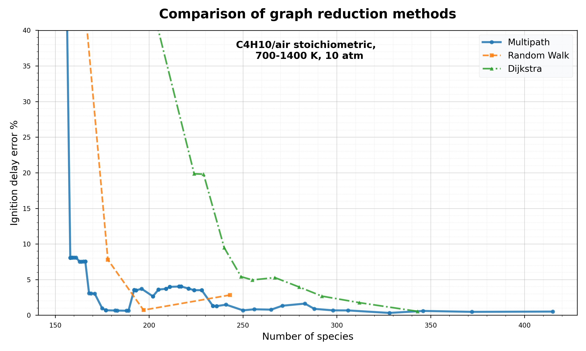
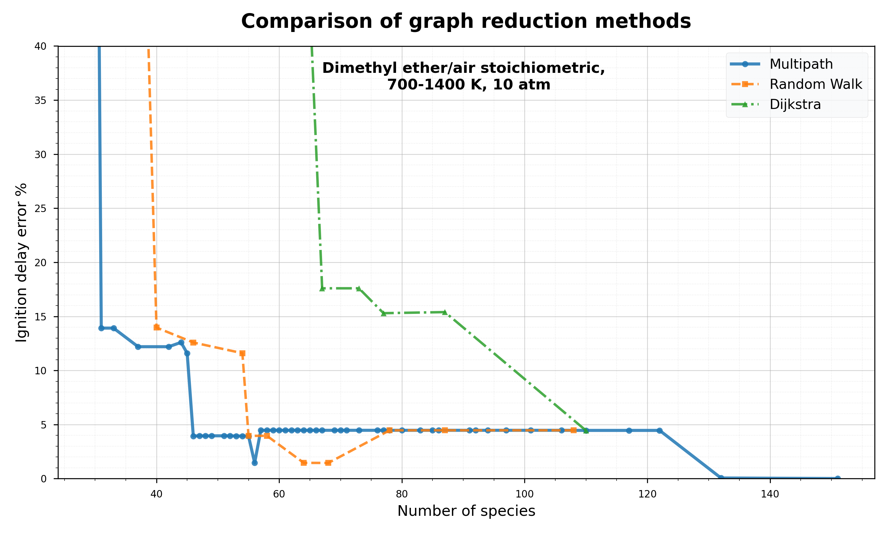
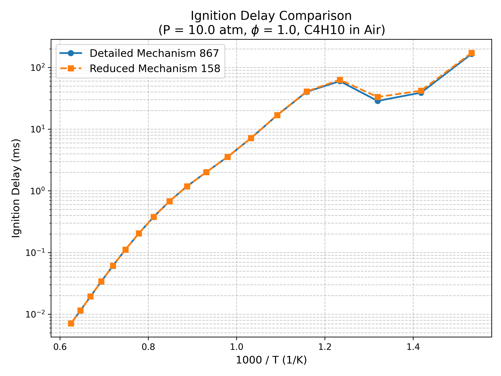
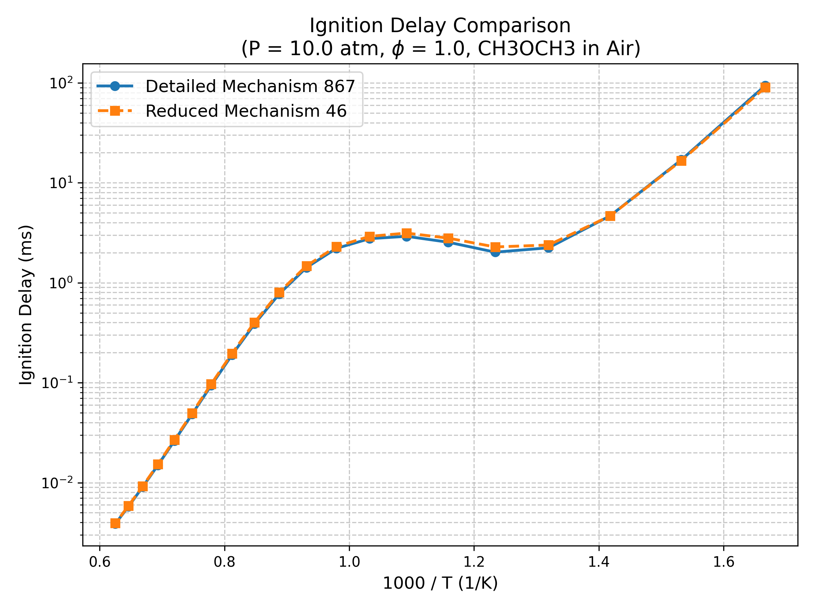

# Multipath & Random-Walk Extensions of DRGEP

This repository implements graph-search algorithms to improve SOTA technique **Directed Relation Graph with Error Propagation (DRGEP)**. By moving beyond the traditional Dijkstra-based "strongest single path" logic, these methods capture more complex chemical dependencies, leading to more compact reduced mechanisms without sacrificing predictive accuracy.

## Results
**Base Mechanism:** C3MechV4.0.1 (867 species)

| n-Butane | DME |
| :---: | :---: |
|  |  |

## 1. Reduction Efficiency
**Target Error Threshold:** 5%

| Interaction Method | n-Butane | Reduction (%) | Dimethyl Ether (DME) | Reduction (%) |
| :--- | :---: | :---: | :---: | :---: |
| **Dijkstra** | 240 species | 72.3% | 110 species | 88.5% |
| **Multipath** | **158 species** | **81.7%** | **46 species** | **94.7%** |
| **Random Walk** | 178 species | 79.5% | 55 species | 93.6% |

| Interaction Method | Runtime (seconds) | Speedup (vs. Dijkstra) |
| :--- | :---: | :---: |
| **Dijkstra** | 163.87 | 1.0× |
| **Multipath** | **12.66** | **12.9×** |
| **Random Walk** | 49.37 | 3.3× |

> **Note on Convergence:** While the Multipath method offers the fastest raw runtime, it produces a more continuous distribution of interaction coefficients. This requires more iterations during the pruning phase compared to the greedier Dijkstra approach, which tends to drop species more abruptly.

## Comparison of ignition delays between base and reduced mechanism
The reduced mechanisms were validated by simulating ignition delays across a wide temperature range. The **Negative Temperature Coefficient (NTC)** behavior of N-butane and distinct low temperature reactivity of dimethyl ether is well retained.

| n-Butane | DME |
| :---: | :---: |
|  |  |

## Installation & Usage
This implementation work with **pyMARS**.

1.  **Documentation:** [Niemeyer-Research-Group.github.io/pyMARS/](https://Niemeyer-Research-Group.github.io/pyMARS/)
2.  **Basic Usage:**
    ```bash
    python3 -m pymars -i c4_test.yaml --path logs/
    ```

## Reference
1) P. O. Mestas, P. Clayton, and K. E. Niemeyer (2019). pyMARS: automatically reducing chemical kinetic models in Python. Journal of Open Source Software, 4(41), 1543, https://doi.org/10.21105/joss.01543
2) Pepiot-Desjardins, Perrine, and Heinz Pitsch. "An efficient error-propagation-based reduction method for large chemical kinetic mechanisms." Combustion and Flame 154.1-2 (2008): 67-81.
3) Wang, Yiru, et al. "Directed Relation Graph-Based Species Rank (DRGSR): An efficient mechanism reduction algorithm." Combustion and Flame 277 (2025): 114226.
